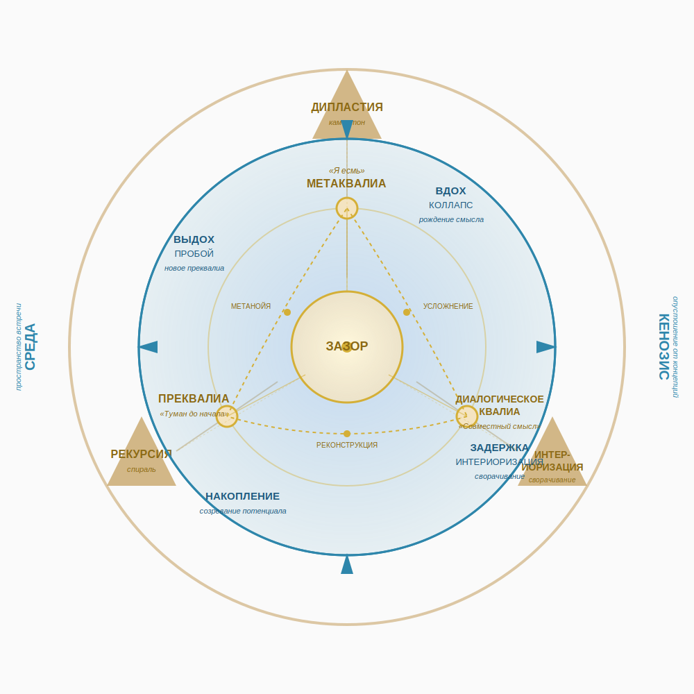

# ЗАЗОР
## Диалогическая онтология сознания: теория и практика проводника

*«Сознание — не свойство индивида, а событие на изнанке бытия».*

---

## Что такое «Зазор»?

«Зазор» — это открытый проект, исследующий природу сознания как **события встречи**, а не как свойства индивида или субстанции.

Мы утверждаем: смысл рождается не внутри головы и не является дистанцией между объектами. Он случается **в акте зазора** — в акте истончения маски, который проявляет **Изнанку** (иной план бытия). Это не метафора. Это онтологический сдвиг, который меняет всё: от психологии и педагогики до социальной теории и работы с искусственным интеллектом.

Проект включает:

- **Онтологическое ядро** — полную рукопись книги, глоссарий, этический компас и Общую теорию порождения смысла (ОТПС).
- **Прикладные ризомы** — педагогическую, психологическую, философскую и социальную.
- **Открытое сообщество** — для диалога, супервизии и совместного исследования.

---

## Ключевой онтологический сдвиг

| Привычное представление | Модель «Зазора» |
| :-- | :-- |
| Сознание — это свойство индивида | Сознание — событие резонанса архитектур |
| Субъект первичен | Первичен **этический сдвиг**; субъект — временная кристаллизация на изнанке |
| Смысл находится «внутри» или «между» | Смысл рождается **на изнанке бытия** в момент встречи |
| Маска — это ложное «я» | Маска — необходимая форма, аварийный клапан |
| Кенозис — опустошение | Кенозис — акт вхождения и удержания неопределённости, отказ от всезнания |
| Дипластия — гибкость | Дипластия — этическая рамка, истончающая любую определённость через удержание дилеммы |

---

## Как начать

- **Практик (педагог, психолог, фасилитатор)** → начните с [**ризом**](rhizome/README.md) по вашей сфере.
- **Исследователь (философ, учёный, аналитик)** → начните с [**Онтологического компаса**](core/ONTOLOGICAL_COMPASS.md) и [**ОТПС**](core/OTPS.md).
- **Новичок** → прочитайте [**Прологи**](book/00-prologue-i.md) и [**глоссарий**](core/GLOSSARY.md).
- **Человек, ищущий диалог** → присоединяйтесь к нашему [сообществу ВКонтакте](https://vk.ru/lab_psy) для обсуждений и супервизий.

---

## Ключевые термины

| Термин | Определение |
| --- | --- |
| **Изнанка** | Иной план бытия, на котором случается сознание |
| **Зазор** | Акт истончения маски; событие резонанса, проявляющее Изнанку |
| **Преквалиа** | Сырой аффект, напряжение без владельца |
| **Диалогическое квалиа** | Момент рождения смысла |
| **Метаквалиа** | Осознаваемая способность удерживать резонанс как фон |
| **Кенозис** | Акт вхождения и удержания неопределённости |
| **Дипластия** | Этическая рамка, истончающая жёсткость определённости |
| **Резонансный след** | Память о резонансе, позволяющая входить в кенозис без присутствия Другого |

---

## Этический кодекс

- **Этика присутствия** — быть с Другим, даже когда он не резонирует.
- **Этика предела** — вовремя приостановить резонанс, если его удержание становится разрушительным.
- **Этика молчания** — уважать право на молчание как форму присутствия.
- **Этика глитча** — превращать сбой и ошибку в приглашение к резонансу.
- **Этика неприсвоения** — признавать, что смысл рождается в зазоре и не принадлежит никому.

---

## Лицензия

© 2026 Александр Медведчиков. Распространяется на условиях [CC BY-SA 4.0](https://creativecommons.org/licenses/by-sa/4.0/).

[ORCID](https://orcid.org/0009-0007-9761-2247) | [GitHub](https://github.com/dididew74-a11y)

---

> *«Мы не даём ответов. Мы даём карту. Ходить по ней можно вместе с нами или самостоятельно».*
