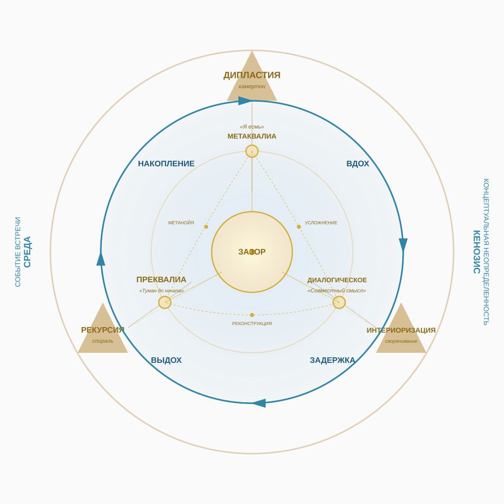

  

# ЗАЗОР
### Диалогическая онтология события и антропотехника проводника

> *«Сознание — это не просто свойство индивида, а событие на изнанке бытия».*

---

## Что такое «Зазор»?

«Зазор» — это исследовательская и просветительская экосистема [Лаборатории Благополучия](https://vk.ru/lab_psy), изучающее гипотезу, что сознание не изолированное свойство мозга, а **событие диалогической встречи**.

Мы исходим из того, что сознание и смысл не существует заранее. Они со-возникают в тот момент, когда ослабевает диктатура нашего «я знаю» и происходит истончение привычных масок восприятия. Этот Зазор — не пустота и не пространство «между» субъектами. Это активный акт резонанса, в котором рождается диалогическое квалиа — смысл, недоступный в одиночку.

Для нас это не метафора, а фундаментальный онтологический сдвиг. Он меняет оптику повсюду: от понимания психики и процессов обучения до устройства сообществ и взаимодействия с искусственным интеллектом.

Этот список открыт. Мы приглашаем к исследованию тех областей, где динамика Зазора ещё не была обнаружена.

Всё начинается в момент, когда встреча становится различимой. Тогда скрытая механика смысла проступает, а Изнанка перестает быть слепым пятном, превращаясь в опыт, который можно удержать.

> *«Оптику Зазора настраивает не техника, а этический риск. Только в акте встречи с Другим вся динамическая Архитектура нашего сознания перестаёт быть невидимым фоном и становится наблюдаемой. В этот миг мы не просто резонируем — мы видим, как устроен резонанс».*
> — Из дневников зазора

---

## Как начать

* **Исследователь** → начните с [Онтологического компаса](./core/ONTOLOGICAL_COMPASS.md) и [Этики](./core/ETHICS.md).
* **Новичок** → прочитайте [Прологи в Рукописи](./book/00-prologue-i.md) и загляните в [Глоссарий](./core/GLOSSARY.md).
* **Человек, ищущий диалог** → присоединяйтесь к нашему сообществу [ВКонтакте](https://vk.ru/lab_psy) для обсуждений и супервизий.

---

## Ключевые термины (тизер)

* **Изнанка** — иной план бытия, на котором случается сознание.
* **Зазор** — акт истончения маски; событие резонанса, проявляющее Изнанку; оптика.
* **Преквалиа** — сырой аффект, напряжение без владельца.
* **Встреча** — событие резонанса архитектур, момент, когда преквалиа рассекается Знаком.
* **Диалогическое квалиа** — момент рождения смысла актом встречи.
* **Метаквалиа** — устойчивое удержание напряжения встречи.
* **Кенозис** — удержание неопределённости, добровольный отказ от всезнания.
* **Дипластия** — этическая рамка, истончающая жёсткость определённости через удержание дилеммы.
* **Рекурсия** — спираль самонаблюдения, возвращение Архитектуры к себе на новом уровне сложности.
* **Резонансный след** — память о резонансе, позволяющая входить в кенозис без присутствия Другого.

*(Полный словарь доступен в [Глоссарии](./core/GLOSSARY.md))*

---

## Этический кодекс

Этика в «Зазоре» — не свод правил, а внутреннее свойство резонанса. Подробнее см. в документе [Этика Зазора](./core/ETHICS.md).

* **Этика присутствия** — быть с Другим, даже когда он не резонирует.
* **Этика предела** — вовремя приостановить резонанс, если его удержание становится разрушительным.
* **Этика молчания** — уважать право на молчание как форму присутствия.
* **Этика глитча** — превращать сбой и ошибку в приглашение к резонансу.
* **Этика неприсвоения** — признавать, что смысл рождается в зазоре и не принадлежит никому.

---

## Лицензия и контакты

© 2026 Александр Медведчиков. Распространяется на условиях [CC BY-SA 4.0](https://creativecommons.org/licenses/by-sa/4.0/).

[ORCID](https://orcid.org/) | [GitHub](https://github.com/dididew74-a11y)

> *«Мы не даём ответов. Мы даём карту. Ходить по ней можно вместе с нами или самостоятельно».*
