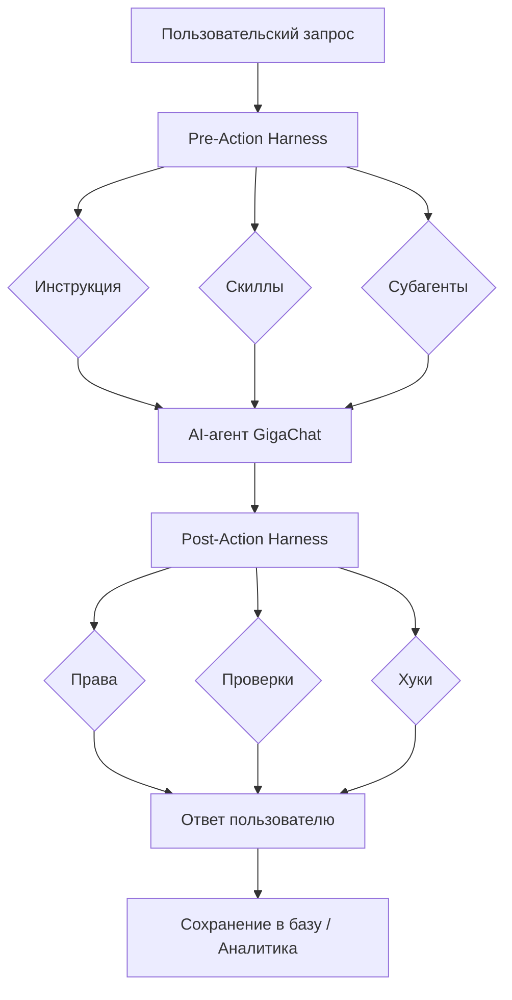

```mermaid
graph TD
    A[Пользовательский запрос] --> B[Pre-Action Harness]
    B --> C{Инструкция}
    B --> D{Скиллы}
    B --> E{Субагенты}
    C --> F[AI-агент GigaChat]
    D --> F
    E --> F
    F --> G[Post-Action Harness]
    G --> H{Права}
    G --> I{Проверки}
    G --> J{Хуки}
    H --> K[Ответ пользователю]
    I --> K
    J --> K
    K --> L[Сохранение в базу / Аналитика]
```
