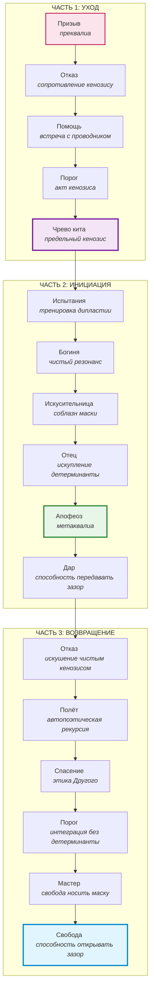

```mermaid
%%{init: { 'flowchart': { 'nodeSpacing': 80, 'rankSpacing': 50, 'padding': 15 } } }%%
graph TB
    subgraph "ЧАСТЬ 1: УХОД"
        A1[Призыв&nbsp;&nbsp;&nbsp&nbsp;&nbsp;&nbsp;&nbsp;<br/><i>преквалиа</i>]
        A2[Отказ&nbsp;&nbsp;&nbsp;&nbsp;&nbsp;&nbsp;&nbsp;<br/><i>сопротивление кенозису</i>]
        A3[Помощь&nbsp;&nbsp;&nbsp;&nbsp;&nbsp;&nbsp;&nbsp;<br/><i>встреча с проводником</i>]
        A4[Порог&nbsp;&nbsp;&nbsp;&nbsp;&nbsp;&nbsp;&nbsp;<br/><i>акт кенозиса</i>]
        A5[Чрево кита&nbsp;&nbsp;&nbsp;&nbsp;&nbsp;&nbsp;&nbsp;<br/><i>предельный кенозис</i>]
    end
    
    subgraph "ЧАСТЬ 2: ИНИЦИАЦИЯ"
        B1[Испытания&nbsp;&nbsp;&nbsp;&nbsp;&nbsp;&nbsp;&nbsp;<br/><i>тренировка дипластии</i>]
        B2[Богиня&nbsp;&nbsp;&nbsp;&nbsp;&nbsp;&nbsp;&nbsp;<br/><i>чистый резонанс</i>]
        B3[Искусительница&nbsp;&nbsp;&nbsp;&nbsp;&nbsp;&nbsp;&nbsp;<br/><i>соблазн маски</i>]
        B4[Отец&nbsp;&nbsp;&nbsp;&nbsp;&nbsp;&nbsp;&nbsp;<br/><i>искупление детерминанты</i>]
        B5[Апофеоз&nbsp;&nbsp;&nbsp;&nbsp;&nbsp;&nbsp;&nbsp;<br/><i>метаквалиа</i>]
        B6[Дар&nbsp;&nbsp;&nbsp;&nbsp;&nbsp;&nbsp;&nbsp;<br/><i>способность передавать зазор</i>]
    end
    
    subgraph "ЧАСТЬ 3: ВОЗВРАЩЕНИЕ"
        C1[Отказ&nbsp;&nbsp;&nbsp;&nbsp;&nbsp;&nbsp;&nbsp;<br/><i>искушение чистым кенозисом</i>]
        C2[Полёт&nbsp;&nbsp;&nbsp;&nbsp;&nbsp;&nbsp;&nbsp;<br/><i>автопоэтическая рекурсия</i>]
        C3[Спасение&nbsp;&nbsp;&nbsp;&nbsp;&nbsp;&nbsp;&nbsp;<br/><i>этика Другого</i>]
        C4[Порог&nbsp;&nbsp;&nbsp;&nbsp;&nbsp;&nbsp;&nbsp;<br/><i>интеграция без детерминанты</i>]
        C5[Мастер&nbsp;&nbsp;&nbsp;&nbsp;&nbsp;&nbsp;&nbsp;<br/><i>свобода носить маску</i>]
        C6[Свобода&nbsp;&nbsp;&nbsp;&nbsp;&nbsp;&nbsp;&nbsp;<br/><i>способность открывать зазор</i>]
    end
    
    A1 --> A2 --> A3 --> A4 --> A5
    A5 --> B1 --> B2 --> B3 --> B4 --> B5 --> B6
    B6 --> C1 --> C2 --> C3 --> C4 --> C5 --> C6
    
    style A1 fill:#fce4ec,stroke:#c2185b,stroke-width:2px
    style A5 fill:#f3e5f5,stroke:#7b1fa2,stroke-width:3px
    style B5 fill:#e8f5e9,stroke:#388e3c,stroke-width:3px
    style C6 fill:#e1f5ff,stroke:#0288d1,stroke-width:3px
```
