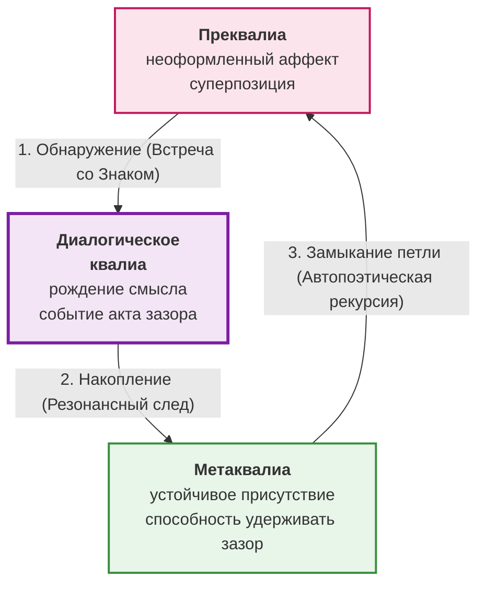

# Архитектура опыта

В основе нашего исследования лежит одна триада, описывающая структуру сознания. Это три уровня переживания, которые будут раскрываться в каждой главе на новом материале:

- **Преквалиа** — неоформленный аффект. Смутное беспокойство, «туман до начала», суперпозиция.
- **Диалогическое квалиа** — момент встречи, рождение смысла. Событие акта зазора, искра контакта.
- **Метаквалиа** — устойчивая способность удерживать зазор. Чистое присутствие, состояние потока.

Эту структуру приводят в движение три динамических принципа. Они не заменяют друг друга, а работают вместе: один обнаруживает зазор, другой конденсирует интерпсихическое событие встречи в интрапсихическую структуру, третий замыкает петлю, делая каждую новую встречу более чувствительной.

Паттерн — это карта. Принципы — это двигатель. Всё остальное в книге — лишь разные способы их увидеть. Без этих принципов паттерн остался бы статичной схемой. Без паттерна принципы были бы абстрактными силами без формы.

Задержитесь на этом вопросе: именно здесь событие сворачивается в след, а след обретает голос.
