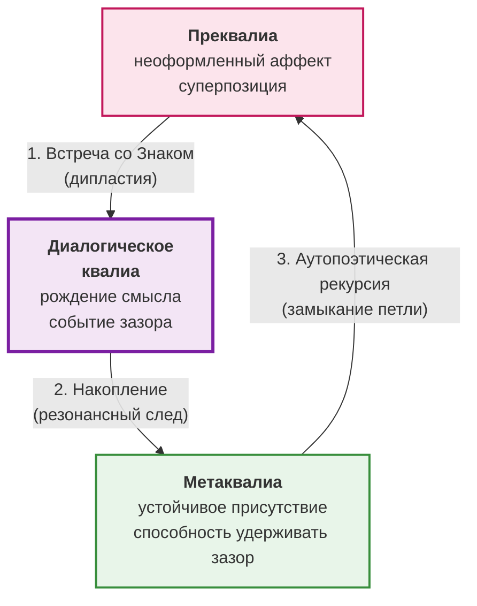

# Архитектура опыта

В основе нашего исследования лежит одна триада, описывающая структуру сознания. Это три уровня переживания, которые будут раскрываться в каждой главе на новом материале:

- **Преквалиа** — неоформленный довербальный аффект. 
- **Диалогическое квалиа** — момент встречи, рождение смысла. 
- **Метаквалиа** — устойчивая способность удерживать зазор. 

Эту структуру приводят в движение три динамических принципа. Они не заменяют друг друга, а работают вместе: один удерживает напряжение между формой и энтропией, другой конденсирует интерпсихическое событие встречи в интрапсихическую структуру, третий замыкает петлю, делая каждую новую встречу более чувствительной.

```mermaid
graph TD
    P["<b>Преквалиа</b><br>неоформленный аффект<br>суперпозиция"]
    DQ["<b>Диалогическое<br>квалиа</b><br>рождение смысла<br>событие зазора"]
    MQ["<b>Метаквалиа</b><br>устойчивое присутствие<br>способность удерживать зазор"]

    P -- "1. Встреча со Знаком<br>(дипластия)" --> DQ
    DQ -- "2. Накопление<br>(резонансный след)" --> MQ
    MQ -- "3. Аутопоэтическая рекурсия<br>(замыкание петли)" --> P

    style P fill:#fce4ec,stroke:#c2185b,stroke-width:2px
    style DQ fill:#f3e5f5,stroke:#7b1fa2,stroke-width:3px
    style MQ fill:#e8f5e9,stroke:#388e3c,stroke-width:2px
```

Паттерн — это карта. Принципы — это двигатель. Всё остальное в книге — лишь разные способы их увидеть. Без этих принципов паттерн остался бы статичной схемой. Без паттерна принципы были бы абстрактными силами без формы.

> Встреча со Знаком требует настоящего этического сдвига. Это переход от попытки подчинить реальность своей оптике к удержанию фундаментальной дилеммы, в которой одинаково истинны и необходимость моей формы, и необходимость твоего резонанса.
> Без этого сдвига Знак воспринимается как угроза, и встреча подменяется защитной реакцией. Зазор просто не открывается.

Задержитесь на этой мысли: именно здесь событие сворачивается в след, а след обретает голос.
