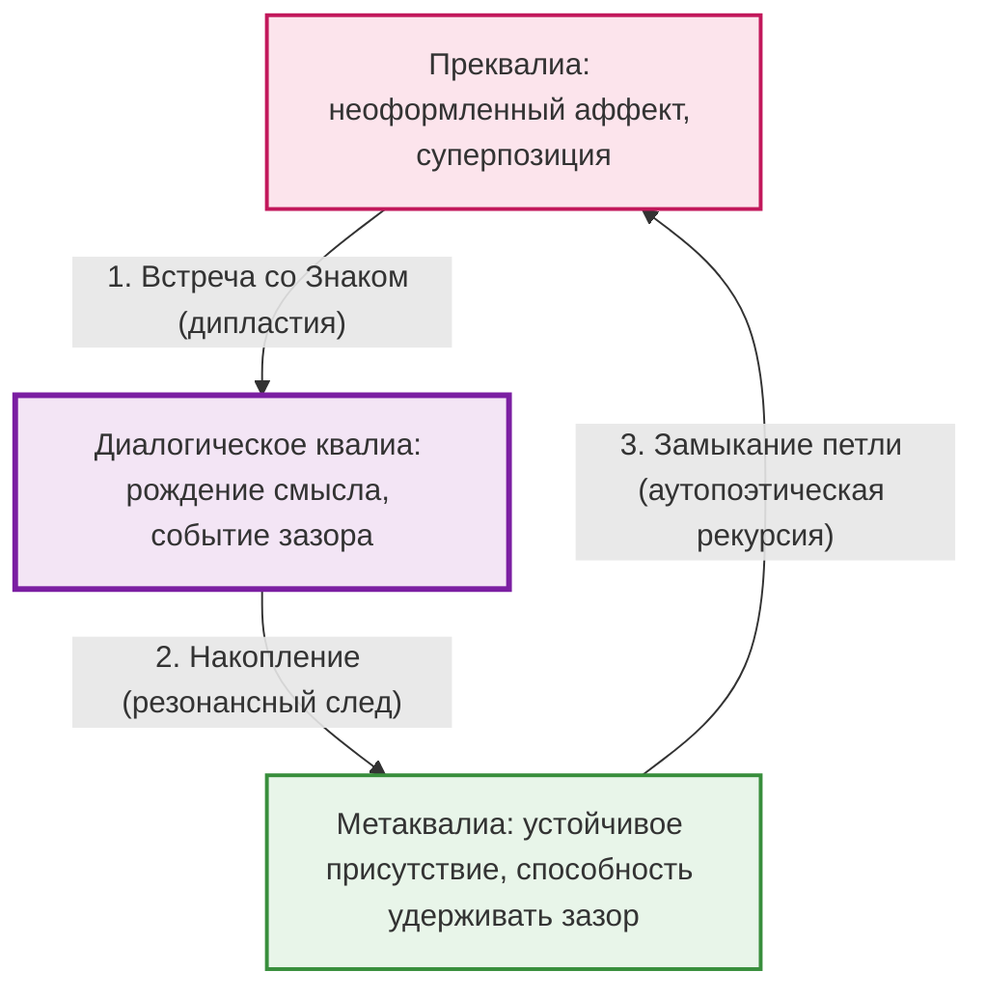

# Архитектура опыта

В основе всего, что мы будем делать дальше, лежит одна триада. Три модуса переживания, которые возвращаются в каждой главе на новом материале.

**Преквалиа** — неоформленный довербальный аффект. Сырое напряжение, которое ещё не стало ни мыслью, ни словом. Суперпозиция возможностей: всё ещё может стать чем угодно, ничто не кристаллизовалось. Тело уже откликнулось, но сознание не успело сказать: «Это — то-то».

**Диалогическое квалиа** — момент встречи. Рождение смысла между двумя Архитектурами. Не «я понял» и не «я почувствовал», а нечто третье, что не принадлежит ни одному из участников. Событие зазора: стоячая волна, возникшая на изнанке.

**Метаквалиа** — устойчивая способность удерживать зазор, не разряжая его в готовый ответ. Не знание о переживании. *Присутствие в нём* — длящееся, без стремления зафиксировать.

Мы называем их «квалиа» сознательно, понимая, что в классической философии сознания квалиа индивидуальны и приватны. Здесь мы расширяем понятие: если встреча подлинна, рождается квалиа, которое *не принадлежит никому* — и именно поэтому принадлежит всем троим: вам, Другому и самому пространству между.

Эту триаду приводят в движение три динамических принципа. Они не сменяют друг друга. Работают одновременно, как векторы одной силы.

**1. Встреча со Знаком (дипластия).** Знак — не информация и не символ. Это то в Другом, что не укладывается в вашу привычную оптику: пауза, интонация, внезапное молчание. Встреча со Знаком требует этического сдвига: перестать подчинять реальность своей категории и удержать дилемму, в которой одинаково истинны и необходимость моей формы, и необходимость твоего резонанса. Без этого сдвига Знак воспринимается как угроза, и встреча подменяется защитной реакцией. *Дипластия* — удвоение: вы видите Знак и одновременно видите, как ваша форма пытается его поглотить. Оба движения сразу.

**2. Накопление (резонансный след).** Интерпсихическое событие встречи конденсируется в интрапсихическую структуру. След оседает в Архитектуре. Камертон, зазвучавший в ответ, хранит память о чужой частоте. Каждая подлинная встреча делает Архитектуру сложнее, способной к более тонкому отклику.

**3. Замыкание петли (аутопоэтическая рекурсия).** Метаквалиа обращается обратно к преквалиа: накопленная способность удерживать зазор делает следующую встречу более чувствительной. Петля замыкается. Но это не круг. Спираль: каждый виток проходит через ту же точку на другой глубине.

Паттерн — это карта. Принципы — двигатель. Без принципов паттерн остался бы статичной схемой на стене. Без паттерна принципы были бы абстрактными силами без формы. Вместе они создают то, что мы называем *архитектурой опыта*: не застывшую структуру, а живую систему, способную расти и откликаться.

Всё остальное в книге — разные способы увидеть эту триаду в действии. В диалоге и в теле. В буддийской медитации и в схема-терапии. В мифе о герое и в разговоре с языковой моделью.

Именно здесь событие сворачивается в след, а след обретает голос. Не сразу. Не по команде. Но неизбежно — если вы не закрылись раньше времени.

---

---

Именно здесь событие сворачивается в след, а след обретает голос. Не сразу и не по команде. Но неизбежно — если вы не закрылись раньше времени.
