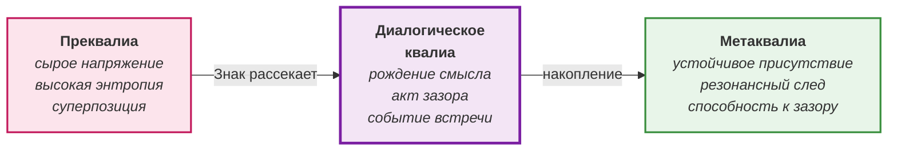

# Глава. Три уровня квалиа

> *«Дуккха — вот, что я учу и исследую».*  
> — Сиддхартха Гаутама (Будда)
> 
> *«Сложность рождается из взаимодействия простых агентов».*  
> — Томас Рэй

Мы утвердили примат зазора. Но что это значит на практике? Как он пульсирует в вас прямо сейчас, пока вы читаете эти строки? Давайте вместе попробуем уловить его ритм. Не как абстрактную концепцию, а как живое переживание, которое уже происходит в вашем теле, в вашем внимании, в этот самый момент встречи с текстом.

*Зазор* — это не пустота и не промежуток. Это резонанс между *Архитектурой* (структурой) и *Средой* (потенциалом), открывающий *изнанку бытия*. Но этот резонанс не монолитен. Он пульсирует, меняет плотность, окрашивается в разные тона. В нём есть разные модусы, разная динамика присутствия. Если не научиться их различать, мы будем говорить о чём-то туманном, и наша онтология останется красивой, но бесполезной схемой.

Нам нужна карта того, что происходит внутри зазора. Эта карта — трёхуровневая модель *квалиа*. Она описывает не «стадии», которые механически сменяют друг друга, а режимы, в которых может пребывать сознание. Мы можем находиться в одном из них, переходить между ними, застревать в них. И каждый из них — это способ удержания или потери резонанса.

### Первый модус: преквалиа

Прежде чем мы дадим определение, давайте на секунду остановимся. Вспомните момент за секунду до того, как вам должны были сообщить важную новость. Вы ещё не знаете, хорошая она или плохая. Вы просто чувствуете, как сгущается воздух. Вот это сгущение, эта дрожь до того, как родилось слово — это и есть то, о чём мы сейчас будем говорить.

Не торопитесь с ответом. Побудьте в этом вопросе.

*Преквалиа* — это состояние «до». До смысла, до формы, до слова. Это не пустота и не отсутствие. Это сгущение. Смутное беспокойство, предчувствие, что что-то вот-вот случится, но что именно — неизвестно. Это как перед грозой: воздух тяжелеет, всё замирает, и ты знаешь, что произойдёт нечто, но не знаешь, что именно.

В терминах нашей модели: *преквалиа* — это чистая *Среда*, ещё не структурированная *Знаком* (Архитектурой). Это потенциал, который не нашёл формы. Это аффект без владельца. Он не принадлежит ни «мне», ни «тебе». Он висит в воздухе встречи, заряженный смысловой энергией, но ещё не имеющий очертаний. Это может быть напряжение перед вопросом, тревога перед встречей, лёгкое беспокойство, которое не оформлено в мысль. Это сырой материал сознания — ещё не присвоенный, ещё не структурированный, но уже заряженный.

*Преквалиа* — это не страдание, а скорее фоновое неудовлетворение, неустойчивость, чувство, что всё ускользает. Это необработанная древесина, материал, который ещё не стал формой. Можно сказать, что это суперпозиция — множество возможностей, ещё не свёрнутых в одно событие. *(Мы используем язык квантовой физики здесь не как онтологическое утверждение, а как поэтическую метафору, чтобы передать динамику неопределённости; подробнее об этом статусе мы поговорим в Части IV).*

В *преквалиа* нет «я». Есть только напряжение. И это напряжение — условие возможности встречи. Это *изнанка*, ещё не ставшая событием.

### Второй модус: диалогическое квалиа

*Диалогическое квалиа* — это вспыхнувшая искра, момент рождения смысла в зазоре. Это когда напряжение *преквалиа* находит форму, когда из хаоса возникает порядок, когда из смутного беспокойства рождается общее понимание. Это не передача информации, а совместное порождение смысла — событие, которое не может быть произведено ни одним из участников по отдельности.

Что именно превращает сырое напряжение *преквалиа* в эту вспышку? Катализатором выступает *Знак* — слово, жест, взгляд или даже намеренная пауза, брошенная в зазор. *Знак* действует как скальпель: он рассекает слитый аффект, называет его и создаёт *различение*. *Диалогическое квалиа* невозможно без этого акта опосредования. Смысл не «висит в воздухе» сам по себе; он кристаллизуется в момент, когда одна Архитектура предъявляет Другому *Знак*, а Другой его принимает и отвечает своим.

В терминах нашей модели: *диалогическое квалиа* — это момент, когда *Архитектура* (структура) и *Среда* (потенциал) входят в резонанс. Архитектура перестаёт быть застывшей формой, Среда перестаёт быть бесформенным потоком. Они встречаются, и в этой встрече рождается смысл, которого не было ни в одном из них по отдельности.

Это момент, когда один человек говорит, а другой кивает, и между ними возникает нечто, чего не было раньше. *Диалогическое квалиа* — это не озарение одиночки. Это совместное рождение. Оно требует как минимум двух голосов и различения между ними. Это вспышка, которая длится мгновение — и, если её не удержать, она угасает.

Здесь *изнанка* становится видимой, но ещё не устойчивой.

### Третий модус: метаквалиа

*Метаквалиа* — это устойчивое пребывание в зазоре. Это не вспышка, а режим. Это переживание «я есмь», целостность, которая не требует подтверждения и не привязана ни к какому содержанию. Это состояние, когда вы не просто участвуете в диалоге, а становитесь самим зазором — когда время исчезает, когда слова не нужны, когда присутствие само по себе является смыслом.

В терминах нашей модели: *метаквалиа* — это резонанс, ставший привычным. Архитектура и Среда больше не разделены; они дышат вместе. Это *изнанка*, которая стала не событием, а фоном, из которого события рождаются и в который они возвращаются.

В практике проводника *метаквалиа* — это тот уровень, на котором участник становится способен удерживать зазор без внешней опоры. *Интерпсихическое* событие встречи конденсируется в *интрапсихическую* структуру (резонансный след). Способность к встрече становится свойством личности, а не только эффектом группы.

### Гнозис: модус метаквалиа

*Гнозис* — это не четвёртый уровень *квалиа*. Это модус, возникающий, когда *метаквалиа* достигает предельной прозрачности. Это не содержимое, а способ, которым *изнанка* отзывается в Архитектуре, когда маска достаточно истончена. *Гнозис* — это узнавание сквозного паттерна реальности, которое случается в зазоре и не принадлежит оператору.

В отличие от *метаквалиа* как устойчивого состояния, *гнозис* — это вспышка узнавания. Но эта вспышка не приходит извне — она возникает как модус самого зазора, когда практика достигает предельной ясности. *Гнозис* не отменяет *кенозис*. *Гнозис* — это *кенозис*, достигший предельной прозрачности.

Мы описали три уровня зазора. Но какой из них вы узнали в себе прямо сейчас? Где вы находитесь в этот момент — в смутном беспокойстве *преквалиа*, в искре *диалогического квалиа* или в устойчивом присутствии *метаквалиа*?

И что произойдёт, если вы позволите себе остаться именно там, где вы есть, не пытаясь немедленно перейти на «следующий уровень»?

### Эксперимент Tierra как иллюстрация

Чтобы понять, как эти уровни работают вместе, обратимся к эксперименту *Tierra*, проведённому Томасом Рэем в начале 1990-х годов. Рэй создал компьютерную среду, в которой простые программы (цифровые организмы) соревновались за процессорное время и память. Они могли мутировать, эволюционировать и порождать потомство. Из этого простого взаимодействия, без центрального управления, возникла сложная экосистема, включая паразитов, хищников и симбиотические отношения. Это пример холодной эмерджентности: сложное поведение возникает из простых правил, не будучи заложенным ни в одной из программ.

Что это говорит нам о зазоре? В *Tierra* смысл возникает из взаимодействия, не принадлежа ни одному из агентов. Это не «чья-то» мысль. Это эффект отношения, эмерджентное событие. Точно так же в диалоге смысл рождается не у «я» и не у «ты», а в резонансе между ними. И этот смысл может становиться всё более сложным, устойчивым, рекурсивным — если зазор остаётся открытым.

В *Tierra* «знаком», порождающим эмерджентность, была строка кода, копирующая саму себя. В человеческой реальности этим знаком является слово или жест. Но онтологический механизм идентичен: смысл всегда является эффектом резонанса, а не свойством изолированного элемента. Зазор — это и есть та самая «вычислительная среда», в которой простые акты присутствия, сталкиваясь, порождают сложную экосистему смыслов.

### Третий динамический принцип: автопоэтическая рекурсия

Сознание не просто возникает в зазоре. Оно воспроизводит себя — через практику, через память, через повторение. Когда *диалогическое квалиа* оседает как *метаквалиа*, оно становится структурой, которая меняет чувствительность к новым *преквалиа*.

Это и есть *автопоэтическая рекурсия*: петля, в которой опыт порождает способность, способность меняет восприятие, восприятие запускает новый опыт. Система воспроизводит себя, сохраняя свою идентичность, через непрерывное обновление своих элементов. В нашем случае системой является зазор, а элементами — акты встречи, моменты рождения смысла, устойчивые состояния присутствия. Каждый новый цикл не повторяет предыдущий, а надстраивается над ним, создавая всё более сложную и чувствительную структуру.

Теория порождает практику, практика возвращается в теорию на новом уровне.

Именно эту петлю мы увидим в Части III, когда проводник создаёт условия для встречи, и эти условия становятся внутренней архитектоникой участников, которые затем входят в новые встречи уже с этой архитектоникой.

Так зазор становится живым, пульсирующим, самовоспроизводящимся. Не статичной структурой, а событием, которое продолжается во времени. Зазор имеет структуру, но эта структура — не сетка, а пульс. *Преквалиа*, *диалогическое квалиа*, *метаквалиа* — это не контейнеры, а режимы. Мы можем скользить между ними, и наша задача как проводников — распознавать, в каком режиме мы находимся, и удерживать зазор достаточно долго, чтобы *метаквалиа* стало устойчивым.

В этом смысле *автопоэтическая рекурсия* — это не просто механизм, а способ бытия сознания. Сознание не есть вещь, которую можно один раз создать и затем хранить. Оно есть процесс, который должен воспроизводить себя в каждом новом акте внимания, в каждом новом признании Другого, в каждом новом удержании зазора. Если этот процесс останавливается, сознание не исчезает — оно возвращается в потенциальный режим, в *преквалиа*, ожидая следующей встречи.

Именно поэтому практика проводника — это не техника, а искусство удерживать эту рекурсивную петлю открытой. Проводник не создаёт смысл, не передаёт знание, не формирует личность. Он создаёт условия, при которых зазор может воспроизводить себя через рекурсию.

Мы начертили карту. Мы увидели, что зазор — это не пустота, а пульсирующий резонанс, способный к самовоспроизводству. Но возникает вопрос, который невозможно обойти.

Если зазор так плодотворен, почему мы так часто от него бежим? Почему предпочитаем разрядить его напряжение в готовые ответы, социальные роли и жёсткие идентичности?

Ответ на этот вопрос — в следующей главе.

---

### Перекрёстные ссылки для дальнейшего пути:

- Если вы хотите понять, как эта триада модусов проявляется в телесной и психологической плоскости, обратитесь к главе [«Аффект, эмоция, чувство»](16-part2-01-affect.md).
- Если вас интересует, как напряжение зазора разряжается в устойчивые структуры (и почему мы так часто выбираем именно это), перейдите к главе [«Маска и кенозис»](12-part1-04-mask.md).
- Если вы хотите увидеть, как тот же паттерн *преквалиа* → *диалогическое квалиа* → *метаквалиа* обнаруживается в восточных традициях, загляните в главу [«Буддийская оптика»](part4-15-buddhism.md).
