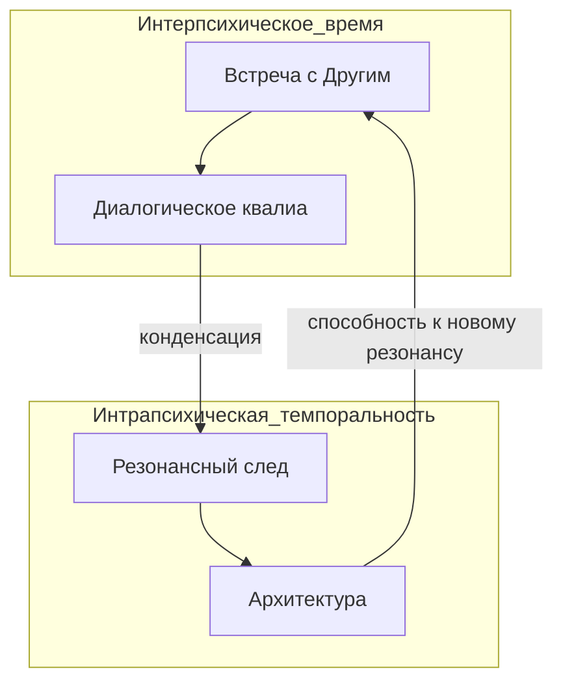

# Глава. Я-позиции и Другой

> *«"Я" может существовать только в диалоге с другими "я"».*  
> — Хьюберт Херманс
>
> *«Всякая высшая психическая функция появляется на сцене дважды».*  
> — Лев Выготский

Прямо сейчас, пока вы читаете эти строки, в вашей психике звучит несколько голосов. Один из них читает. Другой, может быть, комментирует. Третий вспоминает что-то своё. Четвёртый торопит или, наоборот, медлит.

Это не шизофрения. Это здоровая, живая психика. И сейчас мы поговорим о том, что эти голоса — не случайные пассажиры, а следы реальных встреч. Следы Других, которые когда-то вошли в вашу жизнь и остались в ней навсегда.

Но что именно происходит, когда диалог случается? Как встреча с Другим оставляет след в структуре нашего сознания?

Ответ требует одного радикального тезиса: сознание необходимо только тогда, когда есть «я» и «не-я». Когда есть знание, устроенное иначе, чем моё. Другое знание.

---

## Другое знание как условие сознания

Пока знание едино, пока мир — лишь продолжение меня, пока я нахожусь в слиянии с реальностью, сознание не нужно. Оно не возникает. Оно становится необходимым только тогда, когда происходит разрыв. Когда я сталкиваюсь не просто с «другим мнением», а со знанием, которое не вытекает из моего опыта и не может быть встроено в него без перестройки.

Это и есть момент дипластии — динамического принципа, удерживающего напряжение между «я-знанием» и «не-я-знанием», не позволяя системе схлопнуться ни в одно из них. Я и это другое знание — мы оба претендуем на истину. Мы оба находимся в одном поле смысла. Но мы несовместимы. Мы устроены по-разному. И это напряжение, этот зазор между моей структурой и чуждой Средой — условие возможности рождения сознания.

В терминах модели: «другое знание» — вторжение Среды в мою привычную Архитектуру. Оно не вписывается в мои структуры, оно требует их перестройки. И именно эта невозможность вписать, это напряжение — преквалиа, из которого может родиться диалогическое квалиа.

---

## Я-позиции как следы резонанса

Хьюберт Херманс предложил рассматривать личность не как монолитное единство, а как множество *я-позиций* — относительно самостоятельных центров оценивания и ответа, каждый со своим голосом, своей памятью, своей интонацией. Это не расщепление, не патология. Это устройство здоровой психики.

Внутренний диалог — встреча этих позиций. Когда «я-уставший» сталкивается с «я-требовательным», рождается напряжение. Когда «я-наблюдатель» смотрит на их спор, рождается рефлексия.

Но важно понять: эти позиции — не «внутренние сущности», не голоса, локализованные в нейронной активности. Это следы резонансов, которые когда-то случились в контакте с реальными Другими. Каждая я-позиция — кристаллизованный Знак, оставленный событием встречи. Память о том, как изнанка открылась в контакте с кем-то, кто был не мной.

Когда я говорю с собой, я не веду диалог с «внутренним миром». Я активирую следы прошлых резонансов. Голос строгого отца, голос поддерживающего друга, голос учителя, который однажды сказал нечто важное, — все они звучат не как нечто, локализованное внутри меня, а как часть моей Архитектуры. Как структуры, которые могут войти в резонанс друг с другом и с новой Средой.

---

## Резонансный след: от интерпсихического к интрапсихическому

Здесь мы подходим к идее, которая меняет всё.

Лев Выготский утверждал: всякая высшая психическая функция появляется на сцене дважды: сначала как категория интерпсихическая (между людьми), затем как интрапсихическая (как структура личности).

В нашей диалогической онтологии мы переосмысляем это. Встреча с Другим — событие, в котором изнанка открывается в резонансе Архитектуры и Среды. В этой встрече рождается диалогическое квалиа — переживание, которое не принадлежит ни одному из участников.

Но это переживание не исчезает после встречи. Оно оставляет в психике структурный след — резонансный след. Это не «присвоение» квалиа в смысле «я сделал его своим». Это конденсация резонанса во времени: событие встречи сворачивается в структуру личности, оставляя голос, я-позицию, способность к новому отклику.

Когда Другой говорит мне нечто, что не вписывается в мою картину мира, я переживаю преквалиа — смутное напряжение. Если я удерживаю это напряжение, не сбегая в маску, рождается Знак — слово, образ, жест, который фиксирует момент. Этот Знак остаётся со мной. Теперь, чтобы снова войти в резонанс, мне не нужен физический Другой. Я могу активировать этот Знак, и резонанс возобновится — как память тела, как голос, который продолжает звучать.

Резонансный след — это не присвоение переживания в смысле «я помню, что я чувствовал». Это структурное изменение Архитектуры, которое делает возможным новый резонанс. Квалиа не «переходит» внутрь; оно оставляет след, который продолжает работать автономно. Именно поэтому присвоение — вторичный акт, а не суть переживания.

Психика становится не «вместилищем» зазора, а архивом резонансов. Я-позиции — не «внутренние сущности», а активируемые следы прошлых событий. Они — это я, поскольку я есть сумма этих следов, которые могут в любой момент войти в новый резонанс.

Мы не интериоризируем зазор. Мы сохраняем память о резонансе.

---

## Маска как диктатура следа

Этот переход — не перемещение в пространстве (извне вовнутрь), а смена темпоральности. Диалогическое квалиа — событие, разворачивающееся в интерпсихическом времени. Когда встреча завершается, оно сворачивается в интрапсихическую темпоральность. Из «здесь и сейчас» — в «всегда». Из процесса — в структуру. Из глагола — в существительное.

Но что происходит, если встреча была не живой, а маской? Если проводник действовал из роли, то интериоризируется не живой зазор, а мёртвая структура. Она переходит в интрапсихическую темпоральность уже застывшей, не способной к дальнейшему разворачиванию. Это и есть догма: убеждение, которое не может быть реактивировано, потому что оно не было живым событием.

Напротив, интериоризированное метаквалиа не лежит мёртвым грузом. При новой встрече оно может быть реактивировано — развёрнуто обратно в интерпсихический процесс. В этом состоит аутопоэтическая рекурсия: способность системы переходить из одного темпорального модуса в другой и обратно, обогащаясь на каждом витке.

Здесь же кроется природа самой маски. Маска — это диктатура одной я-позиции, одного следа, который подавляет все остальные и объявляет себя единственным «я». «Я — профессионал» и «я-уставший-человек» не могут встретиться, потому что первый подавил второй след. «Я — успешный» и «я-сомневающийся» не могут заговорить, потому что успешность не допускает сомнения.

Кризис идентичности — момент, когда эта диктатура даёт трещину. Подавленные следы прорываются. И это может быть хаосом, а может быть просветом — если мы способны удержать многоголосый хор, не пытаясь немедленно восстановить диктатуру одного голоса. Кенозис — ослабление диктатуры структуры, позволяющее Среде снова зазвучать через другие следы.

---

## Когнитом: нейронаучная проекция

Здесь уместно вспомнить Константина Анохина и его концепцию когнитома. Анохин предложил рассматривать сознание как множество *ког* — относительно автономных нейронных паттернов, каждый из которых отвечает за определённый элемент опыта. Коги не жёстко локализованы в мозге; они собираются и пересобираются в зависимости от контекста, как музыканты, которые объединяются в разные ансамбли в зависимости от того, какую музыку нужно сыграть.

В нашей оптике коги — нейронаучный коррелят я-позиций. Они не предшествуют опыту, а возникают в нём. Они не жёстко детерминированы, а подвижны. И их сборка — процесс, который мы называем диалогом: одни коги активируются, другие затихают, третьи вступают в резонанс. Не механическая ассоциация, а живая полифония.

Сознание необходимо тогда, когда есть «я» и «не-я». В нейрональной динамике это проявляется как конфликт паттернов, как невозможность интегрировать новый опыт в старую структуру. И выход из этого конфликта — не подавление, а создание нового паттерна, новой коги, которая способна вместить и то, и другое. Рождение метаквалиа — переживания целостности, которая не требует уничтожения различий.

---

## Сознание как резонанс следов

Мы установили: сознание необходимо там, где есть «другое знание». Встреча с Другим оставляет след — я-позицию, которая продолжает звучать. Диалог с собой — не разговор с «внутренним миром», а актуализация этих следов, их повторное вхождение в резонанс.

Нет никакого «внешнего» и «внутреннего» зазора. Есть только резонанс изнанки, который может проявляться:

- **В контакте с Другим** — как живое событие встречи, когда изнанка открывается в акте резонанса.
- **В памяти о контакте** — как след этого события, который продолжает вибрировать в структуре нашего сознания.
- **В диалоге с самим собой** — как актуализация этих следов, их повторное вхождение в резонанс.

Это один и тот же резонанс. Просто в одном случае он происходит «здесь и сейчас», а в другом — «здесь и сейчас» оживляет то, что когда-то случилось «там и тогда». Изнанка, которая открывается, — одна и та же. Она не делится на внешнюю и внутреннюю. Она просто меняет частоту.

Но как удерживать этот резонанс в реальной жизни? Как не сбегать в маску, когда встреча с «другим знанием» становится невыносимой?

Ответ — в практике. В следующей части.

---

### Перекрёстные ссылки для дальнейшего пути:

- Если вы хотите вернуться к тому, как аффекты формируют эти следы и как они ощущаются в теле, обратитесь к главе [«Аффект, эмоция, чувство»](16-part2-01-affect.md).
- Если вас интересует, как маска блокирует резонанс следов и приводит к кризису, перейдите к главе [«Кризис идентичности и "культура молчания"»](17-part2-02-identity.md).
- Если вы готовы перейти к практике удержания резонанса и искусству присутствия, обратитесь к [Части III. Феноменология проводника](21-part3-intro.md) (в особенности к главе «От архитектора к аскету»).

