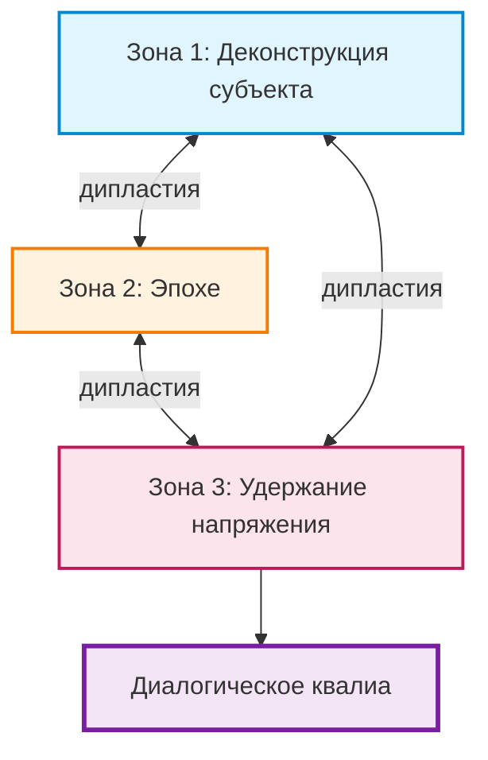
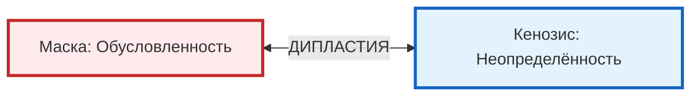

# Глава. Топология кенозиса

> *«Жизнь встречи — это не простая противоположность одиночества. Она вплетена в саму ткань бытия».*  
> — Мартин Бубер

Кенозис — не просто действие и не просто состояние. Это разворачивание в трёх зонах, каждая из которых требует своего способа присутствия.

Три зоны не являются этапами, которые механически сменяют друг друга. Они сосуществуют, переплетаются, дышат вместе. Проводник учится чувствовать, в какой зоне он находится в данный момент, и переключаться между ними, не теряя целостности присутствия.

---

## Зона 1. Деконструкция субъекта

Первая зона — отказ от привычной субъектной позиции. Проводник перестаёт быть центром, вокруг которого всё вращается. Не «я знаю», а «мы ищем». Не «я веду», а «я следую». Это не самоотрицание, а освобождение от диктатуры собственного эго.

Но это освобождение не происходит раз и навсегда. Это перманентное усилие, требующее постоянного возвращения. Каждый раз, когда проводник ловит себя на желании «дать правильный ответ», «направить в нужную сторону», «спасти ситуацию», он должен заметить это и снова войти в деконструкцию. Не отказ от ответственности. Отказ от присвоения.

В терминах модели: деконструкция субъекта — осознанное размыкание структуры «я», чтобы Среда (голос группы, Другого, ситуации) могла зазвучать. Не уничтожение субъекта, а его временное растворение в резонансе. Проводник становится не источником, а резонатором.

Но деконструкция субъекта — не пассивность. Это активное удержание неопределённости. Готовность быть тем, кто не знает, но не убегает от этого незнания. Первый шаг кенозиса.

> *Геометрическая проекция:* точка на ленте Мёбиуса перестаёт считать себя центром поверхности и начинает двигаться по ней, следуя её кривизне.

---

## Зона 2. Эпохе по отношению к Другому

Вторая зона — приостановка оценок, интерпретаций, проекций по отношению к Другому. Эпохе (от греч. ἐποχή — «задержка», «воздержание от суждения») — термин Гуссерля, означающий феноменологическую приостановку естественной установки. В нашей модели: я приостанавливаю свои суждения, чтобы увидеть Другого как событие, а не как объект.

Эта зона — самая трудная, потому что требует постоянного преодоления автоматизма. Мы привыкли оценивать, интерпретировать, классифицировать. Мы привыкли знать, кто перед нами: «этот студент медленный», «эта группа не мотивирована», «этот клиент сопротивляется». И каждый раз, когда мы позволяем этим ярлыкам занять место встречи, мы закрываем резонанс.

В терминах модели: эпохе — отказ от навязывания своей структуры Среде Другого. Признание того, что Другой — не объект для классификации, а живой резонанс, который я могу только принять, но не определить. Не наивность, а дисциплина. Готовность каждый раз встречать Другого как нового, даже если я работаю с ним годами. Потому что Другой никогда не повторяется. Он всегда другой.

> *Геометрическая проекция:* движение по единственной границе ленты Мёбиуса, где «Я» и «Ты» — не два берега, а одна непрерывная линия.

---

## Зона 3. Удержание напряжения в резонансе

Третья зона — само удержание напряжения между первой и второй зонами. Между отказом от центра и отказом от оценок возникает напряжение, которое и есть зазор. Это напряжение не разрешается, не снимается, не объясняется. Оно удерживается.

Удержание — не пассивное терпение. Это активное присутствие. Способность оставаться в точке, где резонанс становится возможным, не спеша заполнить паузу собой или своими интерпретациями. Искусство быть с Другим в том состоянии, когда ничего не происходит, но всё уже возможно.

В терминах модели: удержание — способность оставаться в резонансе Архитектуры и Среды, не позволяя ни одному из полюсов доминировать. Изнанка, удержанная как живое поле, а не как застывшая структура.

Именно в этом удержании рождается диалогическое квалиа. Не как результат, а как событие. Не как продукт, а как вспышка. И эта вспышка не может быть запланирована. Её можно только удержать.

> *Геометрическая проекция:* сама лента Мёбиуса в её целостности — непрерывный переход, который не делится на внешнее и внутреннее, а есть только сама поверхность встречи.

---

## Динамика зазора: как он дышит

Топология кенозиса — не статичная карта. Это описание дыхания зазора. Зазор не находится в одной зоне — он пульсирует между ними, меняет плотность, перетекает из одной фазы в другую.

### Зазор как динамическое напряжение

Зазор — не место и не состояние. Это само напряжение, которое возникает, когда встречаются двое и маски трескаются. Это напряжение не разрешается мгновенно — оно удерживается. И именно в этом удержании, в этой паузе, рождается возможность нового смысла.

Два полюса этого напряжения:
- **Маска** — разрядка в готовую форму, роль, догму, которая схлопывает резонанс.
- **Кенозис** — удержание напряжения без разрядки, которое оставляет резонанс открытым.

Маска даёт покой, но убивает встречу. Кенозис требует усилия, но открывает возможность для рождения нового.

### Маятник: Маска ↔ Кенозис

Это главная динамика зазора. В каждый момент мы выбираем, как разрядить напряжение: в готовую форму или в открытость. Маска — выбор определённости. Кенозис — выбор встречи. Но эти выборы не однократны. Мы качаемся между ними в каждом акте, в каждом дыхании. Проводник не должен быть «всегда в кенозисе». Он должен уметь замечать, когда соскальзывает в маску, и возвращаться.

### Кто совершает это движение

Когда проводник входит в кенозис, это не привычное «я» отказывается от маски. Это оператор трансцендентного — временная кристаллизация зазора — перестаёт отождествляться с маской. Оператор не исчезает, не растворяется в безличной неопределённости; он становится подвижным, гибким, способным переключаться между разными модусами присутствия.

И здесь вступает в силу дипластия: удержание дилеммы между маской (защитой, формой) и кенозисом (уязвимостью, встречей), не позволяя системе схлопнуться ни в одно из них. Кенозис без дипластии был бы саморазрушением; дипластия без кенозиса — застыванием.

### Автопоэтическая рекурсия как дыхание зазора

Этот цикл — не просто повторение. Это спираль. Каждый новый виток делает систему более чувствительной:

1. **Исполнение кода.** Из преквалиа рождается диалогическое квалиа. Сырой аффект встречает Знак Другого и структурируется.
2. **Сворачивание.** Этот опыт конденсируется в резонансный след (я-позицию), становится частью личности — метаквалиа. Внешний резонанс становится доступным как память.
3. **Кенозис.** Чтобы не застыть в этом новом метаквалиа, не превратить его в маску, система добровольно истончает свою обусловленность, возвращаясь в состояние открытости и готовности к новому преквалиа.

Так зазор не застывает в одной зоне, а дышит, пульсирует, живёт. И задача проводника — не управлять этим дыханием, а быть чувствительным к его ритму.

---

## Топология кенозиса и лента Мёбиуса

В Интерлюдии I мы показали, как лента Мёбиуса проектирует нашу онтологию. Теперь мы видим, как та же структура проявляется в динамике кенозиса:

- **Односторонность ленты** соответствует тому, что три зоны кенозиса — не изолированные этапы, а одна непрерывная поверхность практики.
- **Одна граница** соответствует дипластии — способности удерживать «Я» и «не-Я» как одну непрерывную линию, а не как два берега.
- **Неориентируемость** соответствует невозможности однажды «достичь» кенозиса — это постоянный процесс возвращения.
- **Разрезание на трети** соответствует этике встречи: две сцепленные фигуры, сохраняющие идентичность, но структурно связанные.

Кенозис — не техника. Это способ быть на поверхности, которая не имеет верха и низа, внешнего и внутреннего. Способ быть в непрерывном переходе между зонами, не застревая ни в одной из них.

---

Мы начертили карту условий присутствия проводника. Три зоны кенозиса, динамическое напряжение, маятник маски и кенозиса, автопоэтическая рекурсия как дыхание зазора. Всё это описывает не то, что нужно делать, а то, как быть в этом модусе.

Но описание условий — ещё не сама встреча. Живой опыт встречи никогда не сводится к описанию. Как эта карта работает, когда сталкивается с реальным сопротивлением, с живыми голосами, с непредсказуемостью группы?

Мы переходим к свидетельствам.

---

### Перекрёстные ссылки для дальнейшего пути:

- Если вы хотите глубже понять аффективную основу этой динамики и телесные маркеры, обратитесь к главе [«Аффект, эмоция, чувство»](16-part2-01-affect.md).
- Если вас интересует, как маска блокирует кенозис и как работает ловушка нарциссической маски, перейдите к главе [«Маска и кенозис»](12-part1-04-mask.md).
- Если вы готовы встретиться с живыми свидетельствами того, как кенозис проводника запускает резонанс в реальных людях, — следующая глава, [«Феноменология резонанса: одиннадцать свидетельств»](24-part3-03-resonance.md), предъявит эти голоса.
