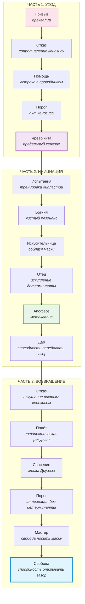

# Глава. Мономиф: путь героя через оптику зазора

*Кэмпбелл, энтропия маски и цикл становления проводника*

> *«Герой — это тот, кто научился жить в зазоре».*

Джозеф Кэмпбелл в «Тысячеликом герое» описал универсальную структуру мифа — мономиф. Это путь героя: уход из обыденного мира, инициация в неизвестном, возвращение с даром. Кэмпбелл показал, что этот паттерн повторяется в мифологиях всех культур.

Но что, если мономиф — это не «путешествие во внешнем мире»? Что если это цикл работы с маской и *кенозисом*? Что если герой — это не тот, кто «совершает подвиги», а тот, кто учится удерживать зазор?

Тогда мономиф — это не просто приключение. Это *энтропийный* цикл:
1. От застывшей маски (обыденный мир).
2. Через *кенозис* (уход в неизвестное).
3. К новой способности резонировать (возвращение с даром).

Каждый этап мономифа — это определённое состояние работы с *преквалиа*. И каждый из нас проходит этот цикл снова и снова — не как линейный путь, а как спираль.

## Часть 1. Уход (DEPARTURE): Схлопывание старой маски

**Призыв к приключению.** Это не «зов судьбы». Это горизонт *преквалиа* — смутное ощущение резонанса, которое не вписывается в текущую *Архитектуру*. Что-то трескается. Старая маска перестаёт работать. Дуккха растёт. Это момент, когда интерпсихическое напряжение (встреча с Другим, кризис, утрата) больше не может быть разряжено в привычную *детерминанту*. Маска, которая раньше спасала, теперь душит. Герой чувствует: «Что-то не так». Но он ещё не знает, что именно. Это чистое *преквалиа* — напряжение без формы.

**Отказ от призыва.** Герой боится. Он цепляется за старую маску. Это сопротивление *кенозису* — страх перед высокой энтропией зазора. «Я не готов». «Пусть всё останется как есть». Это активация защитного модуса. Попытка сбросить *преквалиа* обратно в знакомую форму. Отказ от призыва — это не трусость. Это термодинамическая необходимость: система не может сразу войти в высокий хаос. Но если отказ затягивается, маска становится тюрьмой.

**Сверхъестественная помощь.** Появляется проводник. Тот, кто уже умеет удерживать зазор. Он не даёт герою ответов. Он даёт ему инструмент — понимание, которое позволяет не схлопнуться в маску. Это встреча с *оператором*, обладающим *метаквалиа*. Его присутствие создаёт безопасные *условия*, в которых герой может рискнуть войти в *кенозис*. Проводник не ведёт героя за руку — он показывает, что зазор не убивает.

**Переход первого порога.** Герой переступает черту. Он входит в «неизвестное». Это акт *кенозиса* — добровольный отказ от старой *Архитектуры*. Он больше не знает, кто он. Маска сброшена, но новая ещё не создана. Это чистое *преквалиа*. Высокая энтропия. Отсутствие *детерминант*. Переход порога — это не героический акт. Это акт отчаяния: старая маска больше не держит, и герой вынужден войти в *неопределённость*.

**Чрево кита.** Тёмная ночь души. Герой поглощён неизвестным. Это интерпсихическое время без структуры. Он не может присвоить опыт, потому что нет «Я», которое присваивает. Это предельный *кенозис*. Оператор растворён. Есть только *изнанка*. И если герой выдержит это напряжение, не сбежав в новую маску — родится *диалогическое квалиа*. Чрево кита — это не наказание. Это условие рождения. Без этого растворения нет нового смысла.

## Часть 2. Инициация (INITIATION): Рождение новой способности резонировать

**Дорога испытаний.** Герой сталкивается с серией вызовов. Это не «препятствия». Это тренировка *дипластии*. Каждый вызов — это встреча с Другим, который требует от героя не ответа, а присутствия. Напомним: *дипластия* — это динамический принцип удержания фундаментальной этической дилеммы, где одинаково истинны оба полюса: и необходимость маски (формы), и необходимость *кенозиса* (*неопределённости*). Герой учится удерживать это напряжение в разных модусах. Дорога испытаний — это не серия побед. Это серия поражений, в которых герой учится: маска — это не он. Он — это тот, кто носит маску.

**Встреча с богиней.** Герой встречает фигуру безусловной любви. Это встреча с *изнанкой* без *детерминант*. Богиня не требует. Она просто есть. Она — чистая *Среда*. Это опыт чистого резонанса. Герой обнаруживает, что *изнанка* — это не угроза, а *условие возможности* любви. Что зазор — это не *отсутствие*, а полнота. Это первый опыт *метаквалиа* как устойчивого состояния.

**Женщина как искусительница.** Соблазн вернуться к маске. «Останься здесь. Ты уже достиг». Это искушение застыванием — превратить *метаквалиа* в новую *детерминанту*. Стать «просветлённым», «героем», «учителем». Это риск нарциссической маски. Герой должен отказаться и от этого, чтобы не превратить *кенозис* в новую тюрьму. Искусительница — это проверка: готов ли герой остаться в зазоре, даже когда зазор становится комфортным?

**Искупление отца.** Герой встречается с фигурой власти, закона, *детерминанты*. Отец — это застывшая структура, которая требует подчинения. Герой не убивает отца. Он возвращает ему зазор. Это встреча с собственной интериоризированной *детерминантой*. Герой видит: отец тоже носил маску. И он прощает его. Это высшее проявление *дипластии* по отношению к собственной истории — удержание дилеммы между болью от маски и пониманием её необходимости для выживания отца. Искупление отца — это не бунт. Это узнавание и освобождение.

**Апофеоз.** Герой достигает предельного понимания. Это чистое *метаквалиа* — устойчивое присутствие в зазоре без напряжения. Он видит *изнанку*. Он больше не отделён от неё. Это не «просветление» как конечное состояние. Это способность быть в постоянном резонансе. Герой становится проводником. Апофеоз — это момент, когда герой понимает: мономиф не заканчивается. Он продолжается.

**Окончательный дар.** Герой получает то, ради чего шёл. Но это не «артефакт». Это способность передавать зазор. Дар — это не знание. Это умение создавать *условия*, в которых Другой может открыть собственный *кенозис*. Герой становится *оператором*, который может удерживать интерпсихическое время для других. И это самый опасный дар, потому что он может стать новой маской — маской «того, кто несёт дар».

## Часть 3. Возвращение (RETURN): Интеграция без застывания

**Отказ от возвращения.** Герой не хочет возвращаться в обычный мир. Там — маски, *детерминанты*, сон. Он остаётся в апофеозе. Это искушение вечного *кенозиса* — уйти в чистую *изнанку* и не возвращаться в форму. Но здесь снова вступает в силу *дипластия*. Если герой останется только в *неопределённости*, он нарушит этическую дилемму: форма тоже необходима, чтобы помочь другим. Отказ от возвращения — это бегство. Герой предпочитает чистоту *изнанки* «грязи» живой встречи.

**Магический полёт.** Герой возвращается, но не как обычный человек. Он несёт дар. Это движение от интерпсихического к интрапсихическому — он должен интегрировать опыт, не потеряв его. Это *автопоэтическая рекурсия*. Герой сворачивает время встречи с *изнанкой* в интрапсихическую структуру — но структуру, которая остаётся открытой. Он должен вернуться в форму, но не забыть *изнанку*.

**Спасение извне.** Иногда герою нужна помощь, чтобы вернуться. Кто-то помогает ему *завершить акт* зазора. Это этический акт Другого. Это напоминание: никто не проходит путь в одиночку. Даже проводник нуждается в проводнике. Мономиф — это не индивидуальное достижение. Это коллективный процесс.

**Переход порога возвращения.** Герой возвращается в обычный мир. Но он больше не тот. Это интеграция без *детерминанты*. Он носит маску, но знает, что это маска. Он в мире форм, но помнит *изнанку*. Это *дипластия* как образ жизни. Герой — мастер двух миров: формы и *изнанки*, *Архитектуры* и *Среды*, маски и *кенозиса*.

**Мастер двух миров.** Герой свободно перемещается между маской и зазором. Он может быть в структуре, когда нужно. И может открыть зазор, когда требуется. Это предельная свобода *оператора*. Мастер двух миров — это не сверхчеловек. Это тот, кто научился носить маску, не срастаясь с ней. Кто понимает: маска и *кенозис* — не противоположности, а полюса одного процесса.

**Свобода жить.** Финал пути. Герой не «достиг». Он обретает способность быть. Без страха перед маской. Без цепляния за *кенозис*. Свобода жить — это не свобода от. Это свобода для. Свобода *открывать* зазор снова и снова. Свобода быть проводником — не как роль, а как способ бытия.

## Заключение: Мономиф как цикл проводника

Кэмпбелл описал «путь героя» как универсальную структуру. Но через оптику зазора мы видим: это не миф о подвиге. Это карта работы с собственной *Архитектурой*.

Каждый из нас проходит мономиф снова и снова:
- Когда старая маска перестаёт работать (уход).
- Когда мы входим в неизвестное (инициация).
- Когда мы возвращаемся с новым опытом (возвращение).

И каждый раз вопрос один: сможешь ли ты удержать зазор, не схлопнувшись в новую маску?

Герой — это не тот, кто победил дракона. Герой — это тот, кто научился жить в зазоре.

И это — не привилегия избранных. Это доступная каждому практика. Потому что зазор — это не место. Это акт. И каждый, кто готов истончать маску, может *открыть* его.

---

### Перекрёстные ссылки для дальнейшего пути:

- Если вы хотите увидеть, как этот цикл *кенозиса* проявляется в восточных традициях, перейдите к главам [«Буддийская оптика»](29-part4-01-buddhism.md) и [«Даосская оптика»](30-part4-02-daoism.md).
- Если вас интересует, как психологические защиты (отказ от призыва) и работа с ними описываются в клинической практике, вернитесь к главе [«Энтропия маски: схема-терапия Янга через оптику зазора»](19-part2-04-schema.md).
- Если вы готовы перейти к последним независимым свидетельствам универсальности зазора — следующая глава, [«Карта и путь»](33-part4-05-map-and-path.md), подводит итог.
