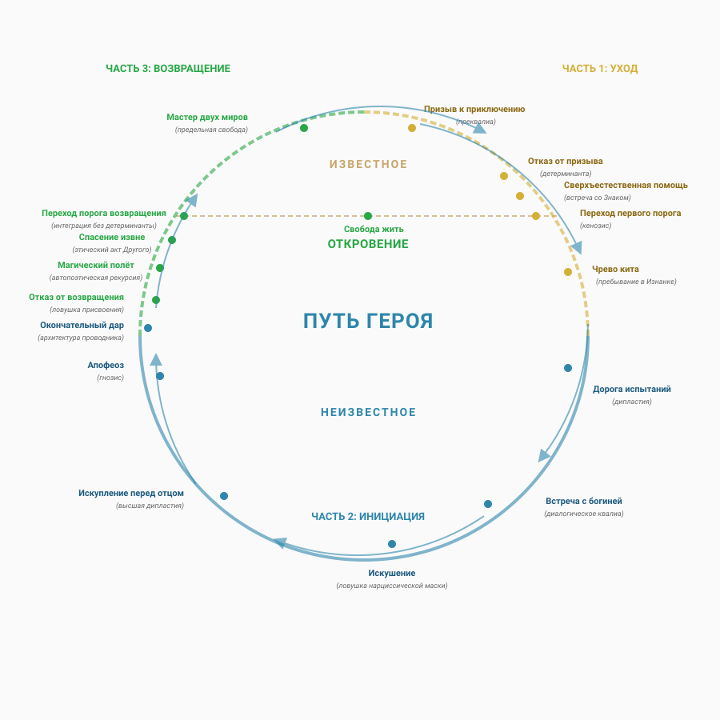

# Глава. Мономиф: путь героя через оптику зазора

> *«Герой отправляется из обыденного мира в область сверхъестественных чудес: там он сталкивается с фантастическими силами и одерживает решающую победу: герой возвращается из этого таинственного приключения с силой даровать благо своим собратьям».*
>  — Джозеф Кемпбелл

Джозеф Кэмпбелл, автор книги «Тысячеликий герой» (1949), совершил настоящий прорыв в изучении мифологии. Он не просто собрал различные сказания, а выявил универсальную структуру, лежащую в основе мифов, легенд и сказок разных народов и эпох. Эту структуру он назвал мономифом (от греческих слов «один» и «миф»). Это путь героя, который состоит из трёх этапов: уход из обычного мира, испытания в неизвестном и возвращение с ценной находкой. Кэмпбелл показал, что этот шаблон повторяется в разных культурах.

Однако мономиф может быть не только «путешествием во внешнем мире». Возможно, это описание динамического цикла Архитектуры сознания и смысла. И, возможно, герой — это не тот, кто совершает подвиги, а тот, кто учится поддерживать баланс между возрастанием энтропии и развитием разума.

Тогда мономиф — это не просто приключение. Это энтропийный цикл:

1. От застывшей маски (привычный мир).
2. Через кенозис (уход в неизвестное).
3. К новой способности (возвращение с подарком).

Каждый этап мономифа связан с особым состоянием зазора. Мы снова и снова проходим этот цикл, не линейно, а по спирали.

## Часть 1. Уход (DEPARTURE): Распад старой маски

***Призыв к приключению.*** «Зов судьбы» — это неясное ощущение бессмысленности жизни. Происходит смена привычного взгляда на вещи. Существующий порядок вещей начинает причинять дискомфорт. Герой чувствует: «Что-то не так», но ещё не понимает, что именно. 

* *Оптика Зазора: **Преквалиа** — напряжение без формы, энтропия превышающее способность к удержанию маски.*

***Отказ от призыва.*** Герой охвачен страхом. Он цепляется за старую маску, которая служит его защитой от хаоса и неизвестности. «Я не готов», — шепчет он. «Пусть всё остаётся как есть». Это его способ сохранить привычное и избежать перемен.

* *Оптика Зазора: **Детерминанта** — защитная фиксация, которая при затягивании решения препятствует преображению. Происходит *блокировка кенозиса* — отказ удерживаться в неопределённости до рождения нового смысла.*

> Этот этап играет ключевую роль во всем процессе. Он либо решается через встречу со Знаком, что открывает путь к следующему этапу — пересечению порога. Либо система остается неподвижной, что делает её уязвимой для разрушения.

***Сверхъестественная помощь.*** Появляется *проводник* — человек, который уже научился существовать в состоянии неопределённости. Он не предлагает готовых решений, а даёт ключ к пониманию, который помогает избежать возвращения к привычному образу. Это встреча с наставником, обладающим особым уровнем восприятия. Его присутствие создаёт условия, при которых герой может решиться на глубокую трансформацию. Проводник не ведёт за собой — он лишь демонстрирует, что неопределённость преодолима.

* *Оптика Зазора: **Знаком** — этап, на котором герой встречает субъекта, воплощающего практику кенозиса, что служит событием резонанса, прорывающим детерминанту и открывающим доступ к Изнанке без угрозы разрушения.*
  
***Переход первого порога.*** Герой идёт в неизвестность. Добровольный отказ от привычного образа жизни — это состояние полной неопределённости и хаоса. Он больше не знает, кто он. Переход через этот порог — это не просто смелость. Это отчаянный шаг и герой вынужден рискнуть, не зная, что его ждёт впереди.

* *Оптика Зазора: **Кенозис** — момент, когда субъект сознательно оставляет детерминанту и погружается в Изнанку, принимая полную неопределённость как необходимую среду для будущего смыслопорождения, ещё не имея новой формы.*

***Чрево кита.*** Тёмная ночь души. Герой попадает в непонятное и неизвестное состояние. Это как время без структуры, когда ничего не ясно. Он не может понять и запомнить свой опыт, потому что будто бы нет того "Я", которое могло бы это сделать. Это самое сильное состояние, когда всё как бы исчезает.
Если герой сможет выдержать это напряжение и не спрятаться за новой ролью или образом, у него появится новое понимание и смысл. Плавание в чреве кита — это не наказание, а возможность для рождения чего-то нового и важного. Без этого растворения и испытания не будет нового понимания.

* *Оптика Зазора: **Пребывание в Изнанке** — этап полного истончения маски, когда субъект остаётся наедине с *метаквалиа*, без возможности зафиксировать опыт через «Я», что является необходимым условием для кристаллизации нового смысла через резонанс с Изнанкой.*

## Часть 2. Инициация (INITIATION): Рождение новой способности резонировать

***Дорога испытаний.*** Герой сталкивается с разными сложными ситуациями. Это не просто преграды, а тренировки. Каждый раз, когда он встречает кого-то нового, ему нужно просто быть рядом, а не искать ответы.
Важно понимать, что иногда нужно притворяться, чтобы выжить или добиться чего-то. Но также важно быть настоящим и открытым. Герой учится держать баланс между этими двумя сторонами.
Путь испытаний — это не просто череда побед. Это и череда неудач. 

* *Оптика Зазора:  **Практика дипластии** — этап, на котором через встречи с Другими и неизбежные неудачи осваивается искусство удержания баланса между маской и подлинностью, между притворством и открытостью (бурная динамика триады: преквалиа-диалогическое квалиа-метаквалиа). Практика дипластии реконструирует Архитектуру, отделяя оператора от маски. Обнаружив, что он — не форма, а тот, кто её носит, оператор осознаёт саму способность к резонансу. Живое начинает звучать сквозь застывшее.*

***Встреча с богиней.*** Герой встречает кого-то, кто любит его безусловно. Это не похоже на обычные отношения, где что-то требуют взамен. Этот человек — просто сам по себе, без условий. Герой понимает, что эта встреча не пугает его, а даёт возможность любить. То, что раньше казалось пустым, на самом деле полно любви. Это первый опыт глубокого и настоящего чувства, которое остаётся с ним надолго.

* *Оптика Зазора: Событие диалогического квалиа (встреча с безусловным резонансом) — этап, на котором  Встреча переживается как резонанс. Без условий, без обмена, без требований. Другой здесь не даёт знания и не требует ответа — он присутствует как Архитектура, излучающая резонанс. Это событие не обогащает информацией, но наполняет смыслом саму способность быть. Оно оставляет в Архитектуре резонансный след Метаквалиа — способность к резонансу, рождённую не из нужды, а из полноты.*

> Безусловная любовь в этом контексте — не чувство, а событие зазора. Изнанка впервые переживается как полнота возможностей. Это не объект поклонения, а поле резонанса, в котором рождается и смысл, и субъект. В этом событии кристаллизуется устойчивый слой метаквалиа.

***Искушение.*** Соблазн вернуться к привычному образу. «Останься здесь. Ты уже добился всего». Это искушение остановиться на достигнутом и превратиться в кого-то особенного. Стать «просветлённым», «героем», «учителем». Но это опасно, потому что можно застрять в своём образе и перестать развиваться. Настоящий герой должен отказаться от этого, чтобы не превратиться в пленника своего успеха. Искушения проверяеют, готов ли герой продолжать путь, отвергнув соблазны.

* *Оптика Зазора: **Ловушка нарциссической маски** — этап, на котором герой сталкивается с соблазном присвоить себе практику кенозиса, застыв в образе «того, кто уже не в маске», и тем самым превратить освобождение в новую, более изощрённую форму детерминанты. Преодоление этого искушения требует отказа от присвоения и способности оставаться в живом резонансе, не фиксируясь в образе «того, кто удерживает зазор».*

***Искупление перед отцом.*** Герой сталкивается с Отцом, символом власти и закона. Отец предстает незыблемой структурой, требующей подчинения. Чтобы преодолеть испытание, герою нужно отказаться от детского эгоизма и юношеского бунта против старшинства. Он понимает, что маска — необходимость, и прощает его. Герой осознает, что «судья» и «родитель» — источник боли и источник любви — одно и то же лицо. Он прекращает делить мир на абсолютное добро и зло. Прощение отца — признание и искупление того аспекта своей личности, который мешал развитию Героя.

* *Оптика Зазора: Высшее проявление **дипластии** — это баланс между болью от маски и осознанием её необходимости для выживания. Это **удержание этической дилеммы:** маска причинила боль, но без неё не существовало бы субъекта. Этот акт объединяет прошлое в целостную Архитектуру, позволяя перестать делить свою историю на «хорошее» и «плохое» и принять её как единое поле, где боль и необходимость не исчезают, а взаимодействуют, создавая новый уровень переживаний.*

***Апофеоз.*** Герой обретает уверенность и ясность, что приводит его к состоянию «просветления». Этот важный этап открывает перед ним новые возможности и перспективы. В некоторых случаях он символизирует завершение прежней версии Героя. Для многих это становится моментом озарения, прорывом, который ведёт к кульминации.

* *Оптика Зазора: **Гнозис** — событие анонимного узнавания, кристаллизующее новый слой метаквалиа как способность Архитектуры к резонансу со всеми своими слоями.* 

***Окончательный дар.*** это кульминационная цель странствия, ради которой герой преодолевал испытания. Этот дар символизирует высшее преображение, расширение сознания и обретение жизненной силы, которую затем необходимо вернуть обычному миру.

* *Оптика Зазора:  **Архитектура Проводника** — для которой кенозис стал привычным актом, а дипластия — постоянной этической рамкой удержания дилеммы между прозрачностью и формой, между присутствием и ненавязыванием, между возможностью стать Знаком и необходимостью оставаться доступной для встречи без присвоения. Свободная динамика модусов квалиа.*

## Часть 3. Возвращение (RETURN): Интеграция без застывания

***Отказ от возвращения.*** это этап мономифа, на котором герой, обретший высшее просветление, силу или божественный дар в сакральном мире, не желает возвращаться в обыденную реальность

* *Оптика Зазора: **Ловушка нарциссической маски** — очень серьезное искушение. Соблазн присвоения практики усиливается соблазном присвоения состояния и превращает прозрачность в непроницаемость, замыкая цикл в новой детерминанте.

***Магический полёт.*** Герой возвращается, но не как обычный человек. Он несёт дар.

* *Оптика Зазора:  **Автопоэтическая рекурсия** — Архитектура сворачивает время встречи с **Изнанкой** в интрапсихическую структуру — но структуру, которая остаётся открытой.*

***Спасение извне.*** Иногда герою нужна помощь, чтобы вернуться. Мономиф — это не индивидуальное достижение. Это коллективный процесс.

* *Оптика Зазора:  Этический акт **Другого**. Это напоминание, что никто не проходит путь в одиночку. Даже проводник нуждается в проводнике.*

***Переход порога возвращения.*** Когда Герой возвращается домой, наступает время признать его внутренние изменения. Возвращение — этап, когда Герой покидает мир хаоса и возвращается к повседневности. 

* *Оптика Зазора: Это интеграция без **детерминанты**. Мы носим маску, зная, что это маска. Мы мире форм, но помнит **Изнанку**. Это *дипластия* как образ жизни. Проводник — мастер двух миров: формы и **Изнанки**, **Архитектуры** и **Среды**, маски и **кенозиса**.*

***Мастер двух миров.*** Герой выжил в хаосе и теперь живет в порядке, став владыкой двух миров. Немногие проходят этот путь и остаются в живых.

* *Оптика Зазора: Предельная свобода **оператора**. Мастер двух миров — это не сверхчеловек. Это тот, кто научился носить маску, не срастаясь с ней. Кто понимает: маска и *кенозис* — не противоположности, а полюса одного процесса.*

***Свобода жить.*** Финал пути. Герой не «достиг». Он обретает способность быть. Без страха перед маской. Без цепляния за *кенозис*. Свобода жить — это не свобода от. Это свобода для. Свобода *открывать* зазор снова и снова. Свобода быть проводником — не как роль, а как способ бытия.

## Заключение: Мономиф как цикл проводника

Кэмпбелл описал «путь героя» как универсальную структуру. Но через оптику зазора мы видим: это не миф о подвиге. Это карта работы с собственной *Архитектурой*.

Каждый из нас проходит мономиф снова и снова:
- Когда старая маска перестаёт работать (уход).
- Когда мы входим в неизвестное (инициация).
- Когда мы возвращаемся с новым опытом (возвращение).

И каждый раз вопрос один: сможешь ли ты удержать зазор, не сливаясь маской?

Герой — это не тот, кто победил дракона. Герой — это тот, кто научился жить в мире с реальностью и изнанкой.

И это — не привилегия избранных. Это доступная каждому практика. Потому что зазор — это не место. Это акт. И каждый, кто готов истончать маску, может *открыть* его.

---

### Перекрёстные ссылки для дальнейшего пути:

- Если вы хотите увидеть, как этот цикл *кенозиса* проявляется в восточных традициях, перейдите к главам [«Буддийская оптика»](29-part4-01-buddhism.md) и [«Даосская оптика»](30-part4-02-daoism.md).
- Если вас интересует, как психологические защиты (отказ от призыва) и работа с ними описываются в клинической практике, вернитесь к главе [«Энтропия маски: схема-терапия Янга через оптику зазора»](19-part2-04-schema.md).
- Если вы готовы перейти к свидетельствам универсальности зазора на примере метакультуры — следующая глава, [««Роза Мира»: гаввах как анти-резонанс»](33-part4-05-roza-mira.md).
- Для уточнения терминологии Зазора [**глоссарий**](core/GLOSSARY.md)
