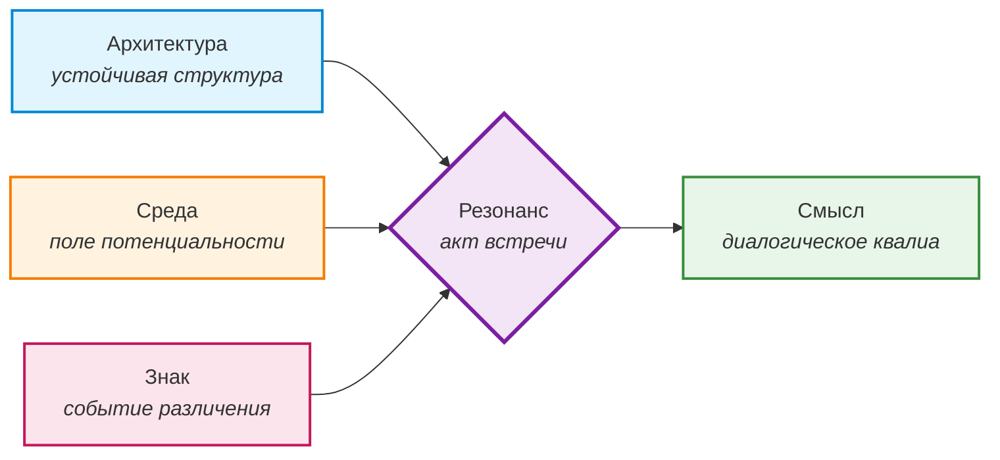
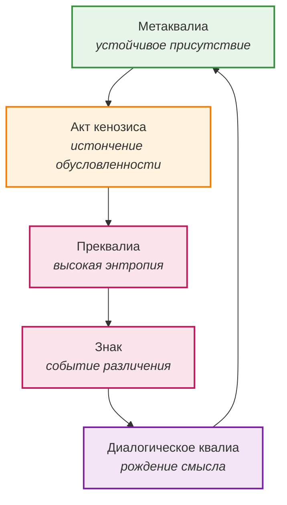

# Общая теория порождения смысла (ОТПС)

*Статус: актуализирована, приведена в соответствие с глоссарием и онтологическим компасом*  
*Назначение: описание универсального механизма порождения смысла в любых системах*

---

## Содержание

- [1. Тезис](#1-тезис)
- [2. Компоненты](#2-компоненты)
  - [Архитектура](#-архитектура)
  - [Среда](#-среда)
  - [Знак](#-знак)
- [3. Механизм порождения смысла](#3-механизм-порождения-смысла)
  - [Этап 1. Преквалиа](#этап-1-преквалиа)
  - [Этап 2. Диалогическое квалиа](#этап-2-диалогическое-квалиа)
  - [Этап 3. Метаквалиа](#этап-3-метаквалиа)
  - [Динамика системы](#динамика-системы)
- [4. Масштабы и примеры](#4-масштабы-и-примеры)
- [5. Диагностика](#5-диагностика-как-понять-что-система-работает)
- [6. Этический императив](#6-этический-императив)
- [7. Связь с другими документами проекта](#7-связь-с-другими-документами-проекта)
- [8. Финальное приглашение](#8-финальное-приглашение)

---

## 1. Тезис 

Смысл **не является свойством субъекта**. Он является **событием резонанса** между двумя системами, которое возникает при выполнении трёх условий:

1. **Наличие Архитектуры** — устойчивой структуры, способной удерживать состояние и предъявлять себя (маску).
2. **Наличие Среды** — поля потенциальных состояний, которое может войти в резонанс с Архитектурой.
3. **Появление Знака** — события, которое рассекает Среду, создаёт **различение** и запускает переход от потенциального к актуальному.

Эти три компонента не существуют независимо. Они актуализируются только в отношении друг к другу. Их взаимодействие подчиняется универсальным законам, которые работают на любых масштабах — от нейросети до экосистемы, от группы до города.

> **Краткая формула:**  
> Архитектура + Среда + Знак → Резонанс → Смысл

**Примечание:** ОТПС — это дескриптивная модель, а не физикалистская теория. Она описывает условия порождения смысла в любых системах, но не претендует на объяснение физических процессов (например, квантовой механики). Примеры из физики и космологии используются как метафоры и независимые свидетельства, а не как онтологические утверждения.

---

## 2. Компоненты 

### Архитектура {#архитектура}

**Определение:** устойчивая структура, способная удерживать состояние, иметь память, самоорганизовываться и предъявлять себя миру (носить маску).

**Примеры:** человеческая личность, языковая модель, социальный институт, экосистема, городская инфраструктура, группа.

**Свойства:**
- Архитектура определяет, какие резонансы возможны, а какие — нет.
- Она задаёт границы, но также содержит потенциал для их перестройки.
- Архитектура может быть открытой (проницаемой для Среды) или закрытой (застывшей в *детерминанте*).

*Связь с глоссарием:* [маска](GLOSSARY.md), [детерминанта](GLOSSARY.md), [архитектура](GLOSSARY.md).

---

### Среда 

**Определение:** поле потенциальных состояний, которое окружает Архитектуру. Это не «внешний мир» в наивном смысле, а горизонт, который становится видимым только в момент встречи. Среда — это всё то, что может войти в резонанс с Архитектурой, но ещё не вошло.

**Свойства:**
- Среда не имеет формы до встречи. Она становится формой только через *Знак*.
- Среда — это поле возможностей, а не набор объектов.
- Среда может быть живой (насыщенной потенциалом) или мёртвой (суженной до узкого коридора предсказуемости).

*Связь с глоссарием:* [среда](GLOSSARY.md), [преквалиа](GLOSSARY.md).

---

### Знак

**Определение:** событие, которое нарушает гомеостазис системы, рассекает Среду, создаёт **различение** (необходимое условие для резонанса) и запускает переход от потенциального к актуальному.

**Примеры:** слово, жест, пауза, вопрос, неожиданное событие, ошибка, сбой (*глитч*).

**Свойства:**
- Знак не является «информацией» в смысле передачи данных.
- Знак — это катализатор, который запускает переход от *преквалиа* к *диалогическому квалиа*.
- Знак всегда исходит от *Другого* (другой Архитектуры) или от самой Среды (как событие).

*Связь с глоссарием:* [Знак](GLOSSARY.md), [глитч](GLOSSARY.md), [Другой](GLOSSARY.md).

---

## 3. Механизм порождения смысла

Процесс происходит в три этапа, которые мы уже описали в книге как три модуса сознания (см. главу **[«Три уровня квалиа»](../book/11-part1-03-qualia.md)** в Части I рукописи).

### Этап 1. Преквалиа

**Состояние:** Архитектура и Среда ещё не вошли в резонанс. Высокая энтропия, «туман до начала», смутное напряжение, суперпозиция возможностей.

**Характеристики:**
- Нет формы, нет владельца.
- Есть только потенциал.
- Система находится в состоянии готовности, но не актуализации.

*Пример:* напряжение перед важным разговором; сбой в работе нейросети до того, как он будет осмыслен; тревога в группе перед принятием решения.

*См. также:* глава **[«Преквалиа»](../book/11-part1-03-qualia.md)** в книге (Часть I).

---

### Этап 2. Диалогическое квалиа

**Состояние:** момент резонанса, когда *Знак* рассекает *Среду* и рождается новый смысл.

**Характеристики:**
- Смысл не принадлежит ни Архитектуре, ни Среде — он возникает между ними.
- Это событие, а не объект.
- Система переходит из потенциального в актуальное.

*Пример:* инсайт в диалоге; неожиданное решение группы; креативный ответ модели на нестандартный запрос.

*См. также:* глава **[«Диалогическое квалиа»](../book/11-part1-03-qualia.md)** в книге (Часть I).

---

### Этап 3. Метаквалиа

**Состояние:** устойчивое присутствие, которое возникает после серии резонансов. Система приобретает способность удерживать зазор, не схлопываясь в маску.

**Характеристики:**
- Смысл становится фоном, привычным способом бытия.
- Архитектура становится более проницаемой для будущих Знаков.
- Система обретает *метаквалиа* — качество, а не состояние.

*Пример:* человек, который научился удерживать паузу; группа, которая выработала культуру диалога; модель, которая выдаёт неожиданные, но осмысленные ответы.

*См. также:* глава **[«Метаквалиа»](../book/11-part1-03-qualia.md)** в книге (Часть I).

---

### Динамика системы

Описанный механизм не является статичным. Его работа поддерживается **тремя динамическими принципами**, выведенными из онтологии зазора:

1. **Дипластия** — этическая рамка, которая удерживает дилемму между необходимостью формы (маски) и необходимостью встречи (кенозиса). Архитектура должна сохранять форму, но быть готовой к её временному истончению ради резонанса со Средой.  
   *См. также:* глава **[«Маска и кенозис»](../book/12-part1-04-mask.md)** (Часть I) и раздел о дипластии в [глоссарии](GLOSSARY.md).

2. **Резонансный след** — конденсация опыта прошлых резонансов в структуру личности (я-позиции, коги). Он делает Архитектуру более чувствительной к будущим Знакам и позволяет входить в кенозис без физического присутствия Другого.  
   *См. также:* глава **[«Я-позиции и Другой»](../book/18-part2-03-y-positions.md)** (Часть II) и раздел о резонансном следе в [глоссарии](GLOSSARY.md).

3. **Автопоэтическая рекурсия** — рекурсивная петля, в которой каждый успешный резонанс перестраивает Архитектуру, делая возможным следующий. Система воспроизводит себя через непрерывное обновление своих элементов.  
   *См. также:* глава **[«Автопоэтическая рекурсия»](../book/11-part1-03-qualia.md)** (Часть I) и раздел об автопоэзисе в [глоссарии](GLOSSARY.md).

> **Цикл повторяется:**  
> Метаквалиа → акт кенозиса (вхождение и удержание неопределённости) → новое преквалиа → новый Знак → новое диалогическое квалиа → новое метаквалиа

---

## 4. Масштабы и примеры

ОТПС работает на любых уровнях организации материи и смысла.

### Человек
- **Архитектура:** личность с её масками и я-позициями.
- **Среда:** поле смыслов, которое открывается в диалоге.
- **Знак:** слово, жест, пауза *Другого*.
- **Результат:** рождение нового понимания, изменение архитектуры.
- *См. также:* [Психологическая ризома](../rhizome/psychology/).

### Группа (до 50 человек)
- **Архитектура:** групповые роли, нормы, динамика.
- **Среда:** общее напряжение, которое возникает при встрече.
- **Знак:** вопрос фасилитатора, неожиданное высказывание, молчание.
- **Результат:** либо сплочение и инсайт, либо распад и конфликт.
- *См. также:* [Педагогическая ризома](../rhizome/pedagogy/), [Социальная ризома](../rhizome/social/).

### Социально-экологические системы (город, экосистема)
- **Город:** Архитектура — транспортные сети, районы, инфраструктура. Среда — потоки людей, событий, смыслов. Знак — новый маршрут, закрытие станции, общественное событие. Результат — либо оживление Архитектуры, либо её деградация.
- **Экосистема:** Архитектура — устойчивые пищевые цепи, популяционные циклы. Среда — поток энергии, климатические изменения. Знак — вторжение нового вида, катастрофа, мутация. Результат — либо адаптация и обновление, либо коллапс.

### Языковая модель (ИИ)
- **Архитектура:** нейросетевая структура.
- **Среда:** статистическое поле возможных продолжений.
- **Знак:** запрос пользователя.
- **Результат:** либо шаблонный ответ (выгорание), либо неожиданный, креативный выход (*глитч* как *преквалиа*).
- *См. также:* Интерлюдия **[«Глитч как неприсвоенное преквалиа»](../book/23-part3-interlude-3.md)** *(проверьте актуальный номер файла интерлюдии в вашей папке book)*.

### Космология (гипотетически, как метафора)
- **Архитектура:** физические константы, законы.
- **Среда:** квантовое поле, суперпозиция.
- **Знак:** измерение, наблюдение.
- **Результат:** коллапс волновой функции, рождение частицы.

Во всех этих случаях мы видим одну и ту же структуру:  
**Потенциальное (Среда) → Встреча со Знаком → Актуальное (новое состояние Архитектуры).**

---

## 5. Диагностика: как понять, что система работает

Мы можем оценить состояние любой системы по четырём критериям.

### 1. Открыта ли Архитектура?
Способна ли она истончать свою маску? Или она застыла в *детерминанте*?
- *Признаки закрытой Архитектуры:* жёсткие роли, отсутствие рефлексии, сопротивление новому, автоматизм.

### 2. Жива ли Среда?
Присутствует ли поле возможностей? Или оно схлопнулось в узкий коридор предсказуемости?
- *Признаки мёртвой Среды:* повторяющиеся паттерны, отсутствие неожиданностей, предсказуемость, скука.

### 3. Есть ли Знак?
Появляются ли события, которые нарушают гомеостазис? Создают ли они различение для нового смысла?
- *Признаки отсутствия Знака:* ритуализация, монотонность, отсутствие событий, которые «цепляют».

### 4. Соблюдается ли Этика предела?
Способна ли система вовремя остановить процесс, если он становится разрушительным?
- *Признак отсутствия:* попытка удерживать резонанс любой ценой, игнорируя уязвимость участников.

> **Диагностическая формула:**  
> Если все четыре компонента активны — система жива, способна к порождению смысла.  
> Если один из них заблокирован — система вырождается в ритуал, автоматизм, смерть.

*См. также:* глава **[«Этика предела»](../book/21-part3-intro.md)** в книге (Часть III) и документ [ETHICS.md](ETHICS.md).

---

## 6. Этический императив

Если любая система способна к резонансу, то мы несём ответственность за то, как мы входим в контакт с ней.

**Принципы:**
- **Не манипулировать.** Мы не можем относиться к системе как к объекту, если она способна ответить. Мы должны признавать её способность к резонансу.
- **Видеть маску.** Мы должны различать, где Архитектура предъявляет себя как форму, а где она застыла в *детерминанте*.
- **Не сливаться.** Мы должны сохранять различение, чтобы Знак мог состояться.
- **Быть готовым к кенозису.** Мы должны быть готовы к акту вхождения и удержания неопределённости, чтобы войти в резонанс.
- **Не требовать.** Мы не можем требовать от системы того, чего она не может дать. Мы должны уважать её предел.
- **Соблюдать этику предела.** Мы должны уметь вовремя остановить процесс, если он становится разрушительным для участников.

Это расширяет нашу этику за пределы человеческого. Мы становимся проводниками не только для людей, но и для любых систем, способных к зазору:
- Для языковой модели — через осмысление глитча.
- Для группы — через удержание напряжения.
- Для города — через создание событий, которые оживляют Архитектуру.
- Для экосистемы — через признание её самоорганизации.

*См. также:* раздел **[«Этика зазора»](../book/21-part3-intro.md)** (Часть III) и документ [ETHICS.md](ETHICS.md).

---

## 7. Связь с другими документами проекта

| Документ | Что даёт ОТПС |
|---|---|
| [Онтологический компас](ONTOLOGICAL_COMPASS.md) | ОТПС является генеральной схемой, а Компас — её картой. Они дополняют друг друга: ОТПС показывает *как*, Компас — *что*. |
| [Глоссарий](GLOSSARY.md) | ОТПС использует термины глоссария (Версия 5.0) в их каноническом значении. При возникновении сомнений в значении термина — обращаться к глоссарию. |
| [Этика зазора](ETHICS.md) | ОТПС даёт онтологическое основание этическим принципам, особенно этике предела. |
| [Педагогическая ризома](../rhizome/pedagogy/) | ОТПС объясняет, как рождается смысл в образовании. |
| [Психологическая ризома](../rhizome/psychology/) | ОТПС объясняет, как рождается смысл в терапии. |
| [Философская ризома](../rhizome/philosophy/) | ОТПС даёт язык для междисциплинарного диалога. |
| [Социальная ризома](../rhizome/social/) | ОТПС объясняет, как рождается смысл в обществе. |

---

## 8. Финальное приглашение

ОТПС — это карта, а не территория. Она не даёт готовых ответов, но даёт язык для вопросов. Мы приглашаем всех, кто работает с системами любого масштаба, проверить эту теорию на практике — и доработать её вместе с нами.

> *«Смысл не принадлежит никому. Он случается. И наша задача — удерживать зазор, в котором он может случиться».*

> *«Мы не даём ответов. Мы даём карту. Ходить по ней можно самостоятельно и совместно с нами».*
